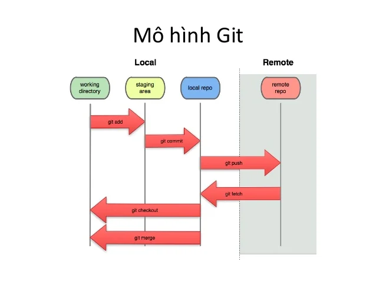

# Commands

## Config

**Short commands**

```
git config --global alias.co checkout
git config --global alias.br branch
git config --global alias.ci commit
git config --global alias.st status
git config --global.st 'status -s'
```

Windows:  
Config file’s location: C:Users{your_name}.gitconfig

```
[core]
	preloadindex = true
	fscache = true
	autocrlf = true
	quotepath = off
[gc]
	auto = 256
[user]
	email = lcdung@example.com
	name = lcdung
[color]
	ui = true
[alias]
	tree = log --oneline --decorate --all --graph
	st = status -s
	ig = update-index --assume-unchanged
	no-ig = update-index --no-assume-unchanged
	co = checkout getlog = log --oneline -10
[credential]
	helper = cache
```

```
git config --global user.email "your_email@example.com"
git config --global user.username"lcdung"
```

**Remember username and password when using [http]**

```
git config --global credential.helper cache
git config credential.helper cache
```

**Ignore files**

```
git update-index --assume-unchanged
git update-index --no-assume-unchanged
```

## Basic commands



**1. Remote**
Mặc định (**origin repository** trên server và **local repository** trên local)

Add remote

```
git remote add <remote_name> <url>
```

Checking name of current remote

```
git remote -v
# View existing remotes
# origin https://github.com/user/repo.git (fetch)
# origin https://github.com/user/repo.git (push)
```

Rename remote

```
git remote rename <old_name> <new_name>
```

Set URL remote

```
git remote set-url https://github.com/user/repo.git
```

Delete

```
git remote rm <remote_name>
```

**2. Add files**

Add multi files

```
git add <file1> <file2>
```

Add all files

```
# Only adding modified files and new files
git add .

# Adding all (deleted, modified and new)
git add --all
```

Pull

```
git pull

git pull <remote_name> <branch_name>
```

Push

```
git push <remote_name> <branch_name>

# Force update
git push -f <remote_name> <branch_name>
```

Fetch

```
# Update remote without deleting branches
git fetch <remote_name>

# Update remote and deleting branch (if have)
git fetch <remote_name> --prune
```

##### Main commands

**1. Init**

```
git init
```

**2. Clone**

```
# Clone repo
git clone <url> {folder_name}

# Clone single branch of repo:
git clone -b <branch_name> <url> {folder_name}
```

**3. Status**

```
git status

git status -s
```

**4. Branch**

```
# List all branch of local
git branch

# List all branch of local and remote
git branch --all

# Create new branch and does not swithc to new branch
git branch <new_branch>

# Creeate new branch and switch to new branch
git checkout -b <new_branch>

# Rename current branch to new_branch_name
git branch -m new_branch_name

# Delete branch on local
git branch -D <branch_name1> <branch_name2> ...

# Delete branch on remote
git push origin :<branch_name1> :<branch_name2> ...
git push origin --delete <branch_name1> <branch_name2>
```

**5. Add files** (above)

**6. Commit**

```
# Commit a message
git commit -m "Sample message"

# Edit commit message ò last commit
git commit --amend -m "Edit sample commit"

# Merge code into last commit
git commit --ament --no-edit
```

**7. Logs**

```
git log

# View short logs
git log --oneline -10

# View pretty logs
git log --oneline --decorate --all --graph
```

**8. Checkout**

```
# Checkout to branch
git checkout <branch_name>

# Checkout to commit hash
git checkout <commit_hash>

# Checkout file with commit hash
git checkout <commit_hash> <file_path>

# Checkout file from another branch
git checkout <branch_name> <file_path>
```

**9. Reset**

```
# Reset HEAD
git reset --hard
git reset origin/master --hard

# Reset with commit hash
git reset <commit_hash>
```

**10. Revert**

```
# Revert with commit hash
git revert <commit_hash>
```

**11. Merge**

```
git merge <branch_name>
```

**12. Rebase**
Để tích hợp các thay đổi từ nhánh này vào nhánh khác và commit trong nhánh hiện tại

```
# Rebase <branch_name> into current branch
git rebase <branch_name>

# Rebase <branch_name2> into <branch_name1>
git rebase <branch_name1> <branch_name2>
```

Rebase on commit: When rebase other branch need checkout other branch

```
git rebase -i <commit_hash>
# Commands:
# p, pick = use commit
# r, reword = use commit, but edit the commit message
# e, edit = use commit, but stop for amending
# s, squash = use commit, but meld into previous commit
# f, fixup = like "squash", but discard this commit's log message
# x, exec = run command (the rest of the line) using shell
#
# These lines can be re-ordered; they are executed from top to bottom.
#
# If you remove a line here THAT COMMIT WILL BE LOST.
#
# However, if you remove everything, the rebase will be aborted.
#
# Note that empty commits are commented out
```

```
# Merge commit
git rebase -i <commit-id-want-to-merge>^

# Usage vim to edit:
i (insert)
Esc (exit edit)
:wq (write quit)

# After rebase using push force:
git push <branch-name> --force
```

**13. Cherry-pick**
Lấy commit từ nhánh khác về nhánh hiện tại

```
git cherry-pick <commit_hash1> <commit_hash2> ..
```

**14. Diff**
So sánh code

```
# Diff two commits
git diff <commit_hash1> <commit_hash2>

# Diff two branches
git diff <branch_1> <branch_2>

# Diff files on two branches
git diff <branch_name1> <branch_name2> -- <file_path>
```

**15. Stash**
Backup hiện trạng đang làm và nhảy code về bất kỳ version được backup trước đó

```
# Stashed all changed
git stash

# List all stash
git stash list

# Show detail a stash
git stash show stash@{0}

# Apply latest stash to current branch
git stash pop

# Apply stash{0} into current branch
git stash pop stash@{0}

# Aplly stash{0} into current branch
git stash apply stash@{0}

# Drop stash{0}
git stash drop stash@{0}

# Clear all stash
git stash clear
```

##### Tip & Notes

List all ignore files:

```
git ls-files -v | grep '^h'
```

Count modified files:

```
git status | grep 'modified:' | wc -l
```

Ignore chmod file:

```
git config core.fileMode false
```

Some commands need to push with option -f:

```
reset
rebase
commit --amend
```

[About page](https://thanhlamkma.github.io/web-knowledge/docs/git/about)

[Q&A page](https://thanhlamkma.github.io/web-knowledge/docs/git/qa)
